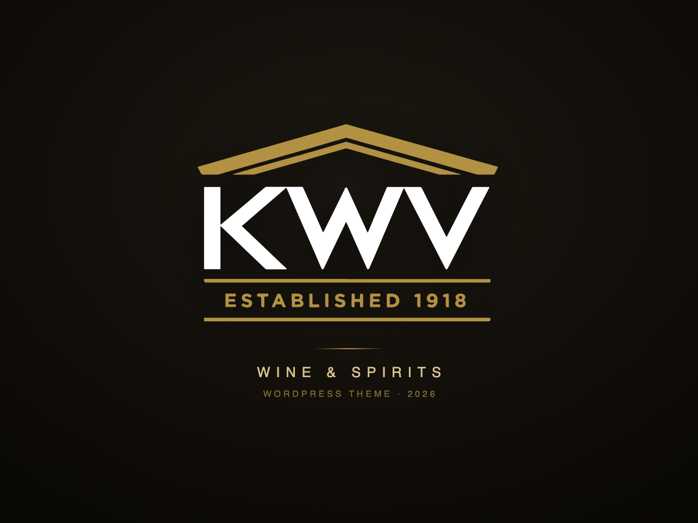

# KWV 2026 — WordPress Block Theme

The **KWV 2026** theme is a WordPress + WooCommerce Full Site Editing (FSE) block theme for [KWV](https://kwv.co.za), a South African wine and spirits brand. It is delivered by [LightSpeed](https://lightspeedwp.agency).



## Overview

KWV 2026 is driven by a Figma-authored design system. Brand colours, typography, spacing, radius, and shadow tokens are extracted from Figma into `theme.json`, keeping the build in sync with the design source of truth. The theme was scaffolded on the Ollie block theme and re-skinned to the KWV brand.

- **Fonts:** Jost (headings) + Figtree (body)
- **Editor:** Full Site Editing — templates, template parts, patterns, and Global Styles
- **Commerce:** WooCommerce templates, parts, and styles

## Requirements

- WordPress 6.0 or later
- PHP 7.3 or later
- WooCommerce (for shop functionality)

## Project Structure

```
kwv-theme-2026/
├── theme.json        # Global Styles + design tokens (generated from Figma)
├── style.css         # Theme header + CSS reset/base
├── functions.php     # Theme setup, block styles, pattern categories
├── inc/              # WooCommerce-specific functions
├── templates/        # Page/post/Woo templates (.html)
├── parts/            # Template parts (header, footer, sidebar, shop)
├── patterns/         # Block patterns (.php)
├── styles/           # Style variations + block styles
└── assets/           # Fonts, per-block CSS, icons
```

## Design → Code Pipeline

Design tokens are **not hand-authored** — they are extracted from the KWV Design System Figma file into `theme.json` via the extractor skills in `.agents/skills/`. See the project `DESIGN.md` for the full token model.

## Development

```bash
npm run dev               # watch patterns, auto-escape for translations
npm run translate:patterns

composer run lint         # PHP syntax
composer run wpcs:scan    # WordPress Coding Standards
composer run wpcs:fix     # auto-fix
```

## Documentation

Project-level guidance lives at the repository root:

- `AGENTS.md` — orchestration guide and scope discipline
- `DESIGN.md` — KWV design system and Figma → theme.json token pipeline
- `CONTRIBUTING.md` — workflow, OpenSpec flow, commits
- `wp-content/themes/kwv-theme-2026/AGENTS.md` — theme-specific build rules

## License

KWV 2026 is licensed under the [GPL-3.0 license](https://www.gnu.org/licenses/gpl-3.0.html).
